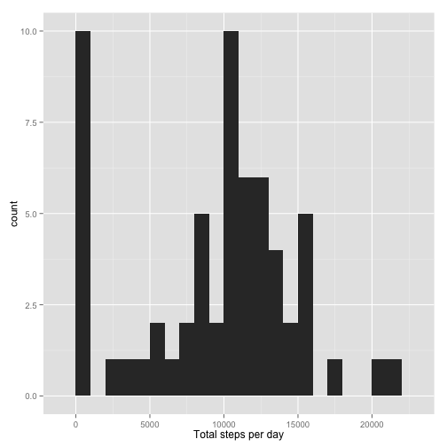
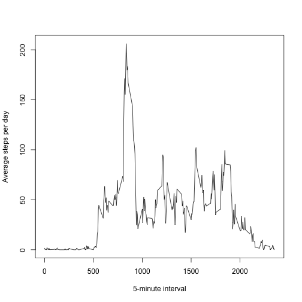
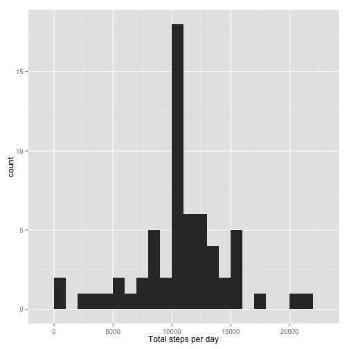
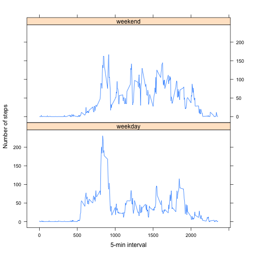

Reproducible Research: Peer Assessment 1
================================================


## Loading and preprocessing the data

```r
library(dplyr); library(ggplot2); library(lattice); library(knitr)
```


```r
unzip(zipfile="activity.zip")
df <- read.csv("activity.csv")
df_na <- read.csv("activity.csv")
df$date2 <- as.Date(df$date, "%Y-%m-%d")
```

## What is mean total number of steps taken per day?

```r
by_df <- group_by(df, date2)
df_sum <- summarise(by_df, steps_per_day = sum(steps))
df_sum$steps_per_day[is.na(df_sum$steps_per_day)] <- 0

ggplot(df_sum, aes(steps_per_day)) + 
        geom_bar(binwidth = 1000) +
        xlab("Total steps per day")
```

 

```r
mean(df_sum$steps_per_day)
```

```
## [1] 9354.23
```

```r
median(df_sum$steps_per_day)
```

```
## [1] 10395
```

## What is the average daily activity pattern?

```r
by_df2 <- group_by(df, interval)
df_sum3 <- summarise(by_df2, mean_steps_per_day = mean(steps, na.rm = TRUE))
plot(x = df_sum3$interval, y = df_sum3$mean_steps_per_day, 
     xlab = "5-minute interval", ylab = "Average steps per day", type= "l")
```

 

On average across all the days in the dataset, the 5-minute interval contains the maximum number of steps?


```r
res <- as.matrix(subset(df_sum3, 
       select = c(interval, mean_steps_per_day), 
       mean_steps_per_day == max(mean_steps_per_day)))
interval <- unname(res[1,1])
mean_steps_per_day <- unname(res[1,2])
```


```r
interval
```

```
## [1] 835
```

```r
mean_steps_per_day
```

```
## [1] 206.1698
```

## Imputing missing values

There are many days/intervals where there are missing values (coded as NA). The presence of missing days may introduce bias into some calculations or summaries of the data.

```r
na <- df_na[is.na(df_na),]
miss <- nrow(na)
miss
```

```
## [1] 2304
```

All of the missing values are filled in with mean value for that 5-minute interval.


```r
merged <- merge(x = df_na, y= df_sum3, by = "interval" , all.x = TRUE)
merged <- arrange(merged, date)
merged$steps[is.na(merged$steps)] <- merged$mean_steps_per_day[is.na(merged$steps)]
```

Now, using the filled data set, let's make a histogram of the total number of steps taken each day and calculate the mean and median total number of steps.


```r
df_imputed <- select(merged, steps, date, interval)
df_imputed$date2 <- as.Date(df_imputed$date, "%Y-%m-%d")
by_df_imputed <- group_by(df_imputed, date2)
df_sum4 <- summarise(by_df_imputed, steps_per_day = sum(steps))
```


```r
ggplot(df_sum4, aes(steps_per_day)) + 
        geom_bar(binwidth = 1000) +
        xlab("Total steps per day")
```

 


```r
mean(df_sum4$steps_per_day)
```

```
## [1] 10766.19
```

```r
median(df_sum4$steps_per_day)
```

```
## [1] 10766.19
```

Mean and median values are higher after imputing missing data. The reason is that in the original data, there are some days with steps values NA for any interval. The total number of steps taken in such days are set to 0s by default. However, after replacing missing steps values with the mean steps of associated interval value, these 0 values are removed from the histogram of total number of steps taken each day.

## Are there differences in activity patterns between weekdays and weekends?

First, let's find the day of the week for each measurement in the dataset. In this part, we use the dataset with the filled-in values.


```r
df_imputed$day <- as.factor(ifelse(weekdays(df_imputed$date2) %in% c("Saturday", "Sunday"), "weekend", "weekday"))
```

Now, let's make a panel plot containing plots of average number of steps taken on weekdays and weekends.


```r
by_df_imputed2 <- group_by(df_imputed, day, interval)
df_sum5 <- summarise(by_df_imputed2, mean_steps_per_day = mean(steps))
xyplot(mean_steps_per_day ~ interval | day, df_sum5, type = "l", layout = c(1,2),
       ylab = "Number of steps", xlab = "5-min interval")
```

 
